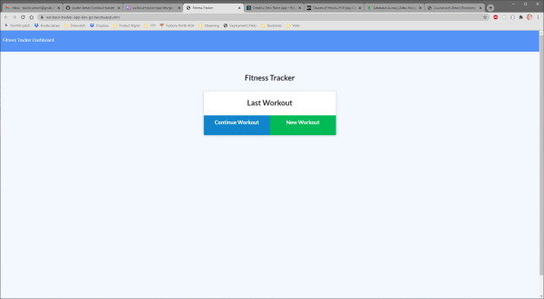
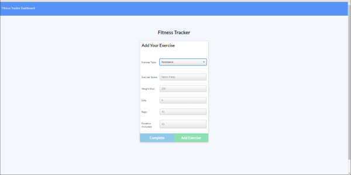

# workout-tracker
This project is a workout tracker that tracks and outputs data related to your workouts

## Motivation
This project was completed to reinforce skills using html, CSS, JavaScript, MongoDB, Express, and Node

## Build status
Passing

## Code style

 
## Screenshots
</img>

## Tech/framework used
HTML
CSS
JavaScript
Mongoose
Express
Node

## Features
App features graphs to show different data points on exercises, such as time, reps, distance, etc.

## Code Example

## Installation
N/A

## API Reference
N/A

## Tests
N/A

## How to use?
Add workout to create a workout. Fill out all fields and add to workout program. Access graphics using the dashboard to see your progress.
</img>
## Contribute
N/A

## Credits
N/A

## License
N/A
